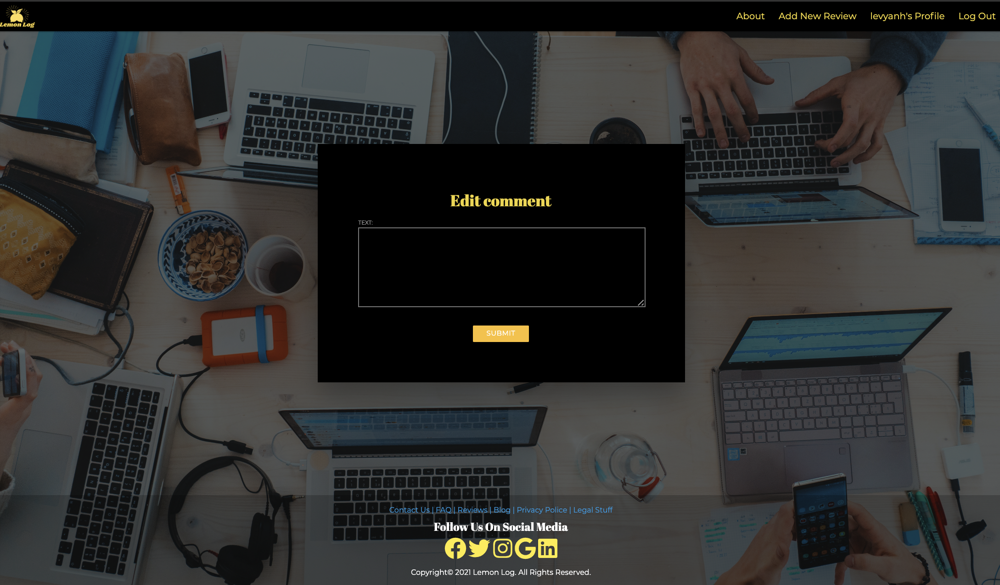

# Project name: Lemon Log

## Project link: 
https://lemonlogtech.herokuapp.com

## Group members:
1. Abinash Mudbhari
2. Anh Vy Le

## Project description:
**Lemon Log** is a tech review site where experts post reviews of tech products to inform their users of what to buy and what to skip. Users can post comments on reviews to share feedback or their own experiences.

## Technologies used:
- Language: HTML, CSS, JS, Python
- Framework: Django
- Database: Postgresql
- Deployment on: Heroku 

## User stories:
### Sprint 1: Basic Auth & Profiles
**A user should be able to:**
1. Navigate to "/" and see a basic splash page with:
- The name of the website.
- Links to "Log In" and "Sign Up".
2. Sign up for an account.
3. Log in to their account if they already have one.
4. Be redirected to their public profile page after logging in.
5. On their public profile page, see their name, join date, last time login.
6. See the site-wide header with Lemon Log logo and the slogan.
- A link to "Log Out" if they're logged in.
- Links to "Log In" and "Sign Up" if they're logged out.
7. Update their profile by making changes to their name.
8. An admin user should be able to add a review to the site through the admin panel.

### Sprint 2: CRUD
**A user should be able to:**
1. View a single review page (at "/reviews/1") including:
- The review title.
- The rating of the product.
- At least one high quality image of the product being reviewed.
2. View a list of reviews on the Home page:
- Sorted by newest first.
- With the review titles linked to the individual review "show" pages.
3. Use an "Add Comment" button on a single review page to pull up the new comment form.
4. Create a new comment for a review.
5. Click "Edit" on ANY individual comment, and be redirected to the edit form.
6. Click "delete" on ANY individual comment, then:
- See a pop-up that says: "Are you sure you want to delete this comment?"
- If the user confirms, delete the comment.

### Sprint 3: Validations & Authorization
**A user should be able to:**
1. Verify that a new comment they create is successfully published on the correct review page.
A user CANNOT save invalid data to the database, according to the following rules:
2. A user CANNOT sign up with an email (or username) that is already in use.
3. A comment must be between 1 and 240 characters.
4. A comment must not be empty.
A user is authorized to perform certain actions on the site, according to the following rules:
5. A user MUST be logged in to create/update/destroy resources.
6. A user may only edit their own profile and edit/delete their own comments.

## Bonus features:
**A user should be able to:**
1. See a "default" profile photo on their profile page before adding their own photo.
2. Update their profile photo.
3. See their profile photo next to their posts.
4. On the homepage:
- See review content truncated to 135 words max, with a link to read more.
- See a relative published date.
6. View an error message when form validations fail, for the following validations:
- Title must be between 1 and 200 characters.
- Content must not be empty.
7. View only 4 reviews on the homepage (pagination), with
- A link/button to the "Next"
- A link/button to the "Previous".
9. See a list of review titles they've contributed comments to, on their public profile
10. See the number of comments they've written for each review, next to the review's title in their profile.
11. Moderate comments on an individual review.
12. See the number of comments a review has on the review's "show" page.
13. Be able to create, edit, and delete reviews through the website rather than through the admin panel.
14. Admins should be able to upload and host their own image files to use in reviews on the site.

## Wireframes:

**Homepage**

**About page**

**Signup page**

**Login page**

**Profile page**

**Review detail page**

**Add review page**

**Edit review**

**Delete review**

**Add comment**

**Edit comment**

**Delete comment**

